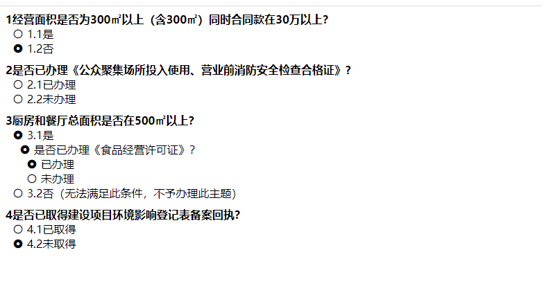
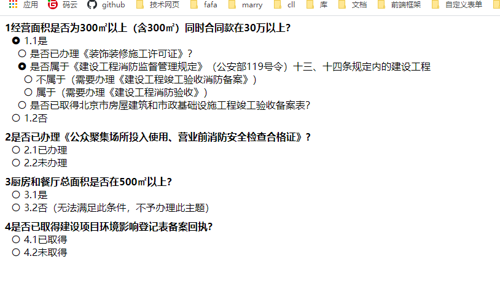

# vue-radio-tree

> A Vue.js tree radio component

## Build Setup

``` bash
# install dependencies
npm i vue-radio-tree or use scrpit link to use it

//main.js中引入
import radioTree from 'vue-radio-tree'
Vue.use(radioTree);


```
###props
|  Prop name   | Description  | Type |Default value |required |
|  ----  | ----  | ---- | ---- | ---- |
| data  | 传入的数据 一个树 |Array |[] |true |
| props  | 属性格式化 |Object |{value: 'id',label: 'name'} |false |
| needShowKey  | 是否显示key |Boolean |false |false |
| chooseColor  | radio选中的颜色 |String |false |false |


###methods
| Function name  | Description  |
|  ----  | ----  |
| getCheckedId  | 获取选中的id,通过refs来操作 |


###slots
| Slot name  | Description  |
|  ----  | ----  |
| titlePrefix  | 在标题中可以使用图标，获取自定义的东西 |


###效果，默认展示第一级，如果有子集存在，点击可以显示下一级


